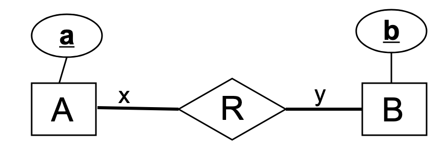
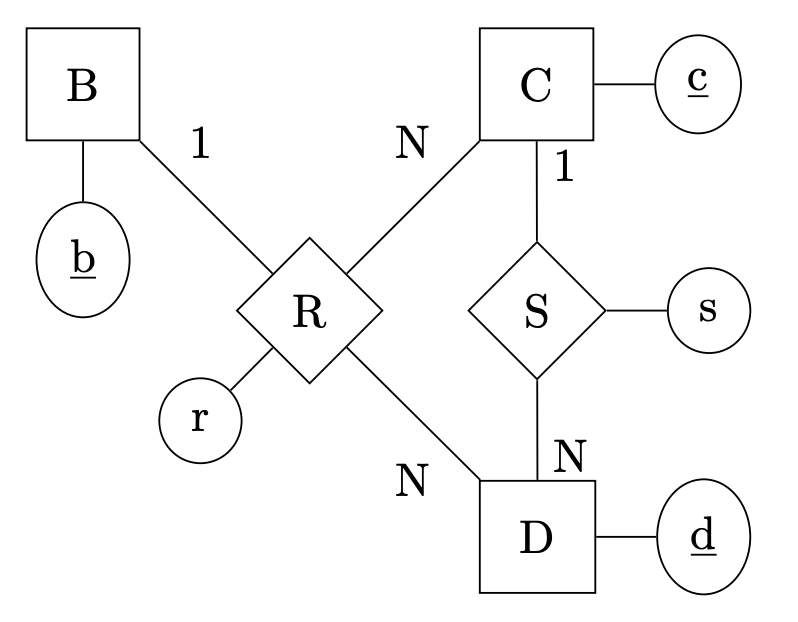

# Lab 3 - ER Model and Relational Model

This lab contains exercises on ER modeling and relational algebra. Some recaps:

* ER modeling: create ER model to describe your application. A model contains entity sets and relations
between them. An entity has a number of attributes, some of them make up the primary key. 

* Relational modeling: translate ER diagram into a set of relations. 

## Exercise 1
Draw a ER diagram for the following. Provide appropriate cardinality information. 

An apartment is located in a house which is in a street which is in a city which is in a country. 

## Exercise 2
Draw a ER diagram for the following. Provide appropriate cardinality information. 

You run a new recording studio, *Studify*, and need to maintain the following information:

+ Each musician that records at Studify has a unique SSN, a name, and date of birth. Poorly paid
musicians often live together at the same address which also has a phone. 

+ Each instrument used for recording at Studify has a unique identification number, a name (e.g., guitar,
synthesizer, flute) and a musical key (e.g., C, B-flat, E-flat).  

+ Each album recorded has a unique identification number, a title, a copyright date, a
format (e.g., CD or MC).  

+ Each song recorded has a unique identification number, a title, an author. 

+ Each musician may play several instruments, and a given instrument may be played by several musicians.

+ Each album has a number of songs on it, but no song may appear on more than one album.

+ Each song is performed by one or more musicians, and a musician may perform multiple songs.

+ Each album has exactly one musician who acts as its producer. A musician may produce several albums.

## Exercise 3
Draw a ER diagram for the following. Provide appropriate cardinality information. 

You want to manage student clubs at the university. But you need to adhere to the following constraints:

+ Each student has a unique student identification number, a name, and pillar. 

+ Each group has a name.

+ Every year, students can form a club. One student may belong to different clubs in different year, but may
belong to at most one club in any given year. 

**More advanced requirements**
+ Each club may travel to different cities. Every city has a name, and belongs to a country.

+ Each club may travel to different cities in different year, but only to one city in any given year.

## Exercise 4

Take a look at the ER diagram above. What are the corresponding relations (schemas) when x:y are mapped
to the following?
+ M : N
+ 1 : N
+ N : 1
+ 1 : 1 (more difficult!)

## Exercise 5

Give the corresponding relational model to the ER diagram above. 
