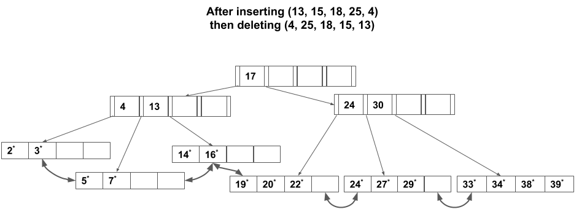

# Lab 6 - DB Operation Costs and Hadoop  

## Database Engine Design and Cost Estimation
This section covers concept learned in Week 5 and 6, where we learned about key components of a database
engine, and how to estimate I/O costs for some popular operations. Some refreshers:

+ Storage manager is responsible for managing database records on disk. It stores records in pages. 
+ Buffer pool manager fetches disk pages into memory and evict pages from memory when it is full.  
+ There are 2 popular indexes: hash and B+ tree. The index can be:
  + Clustered: the data on disk is sorted by the index key. 
  + Unclustered: data on disk is not sorted by the index key. 

  **Make sure you understand how B+ tree insert and delete work**
+ External merge sort is used to sort large amount of data. 
+ Scan can be done directly on heap file, or using index. 
+ Some popular join algorithms: nested loop, block nested loop, Grace hash.  

### Exercise 1
Consider the relation  **Employee(<ins>eid</ins>, sal)** which is stored as a randomly ordered file on disk.
Suppose that you have built an unclustered index on the attribute *sal*. For a query that finds all
records where *sal > 20*, is using this index always the best? Why?

### Exercise 2
You have 4 pages in the buffer pool. Given this sequence of access

**A B C D A F A D G D G E D F**

**[Q1]** What is the hit rate if you use LRU policy? Show the final state of the buffer pool.
(6/14)

**[Q2]** Same as Q1, but for MRU policy. 
(2/14)

**[Q3]** When would MRU be better than LRU?
(Sequential flooding: P1..PN,P1..,PN)

### Exercise 3
Consider the following B+ tree


**[Q1]** Draw the tree after inserting **17, 18, 13, 15, 25**.


**[Q2]** Draw the tree after inserting **13, 15, 18, 25, 4** then deleting **4, 25, 18, 15, 13**. 



(Observe how we get a different tree)

**[Q3]** What observation can you draw from Q1 and Q2 about B+ tree?

(Shape of the tree is dependent of the insert/delete order, not only of the content.)

### Exercise 4
Given 2 relations R and S. 
* R has 100 pages, 100 records per page. 
* S has 50 pages, 50 records per pages.
Suppose we have 20 buffer pages. 

**[Q1]** What is the I/O cost of joining R and S with nested loop join, using S as outer relation. 

50 + 50\*50\*100 = 250,050


**Q[2]** Same as Q1, but with block nested loop join. 

50 + 100\*ceil(50/18) = 350

### Exercise 5
Suppose you need to sort 108-page file using 4 buffer pages, using external sort. 

**[Q1]** How many passes are needed?

4

**[Q2]** What is the total IO cost?

8*108 

**[Q3]** What is the cost if the file is already sorted?

Same cost
## Hadoop
This section contains instructions to get HDFS up and running. It also includes codes for running a simple
MapReduce job (word count) using Hadoop streaming. 

First, some recaps:

* HDFS is the most popular distributed file systems. It consists of:
  + A Namenode that stores metadata and is the point of contact for user requests. 
  + Many Datanodes that store the actual data. 
  + Data is broken into big blocks. 
  + Each file can be replicated. 

* MapReduce provides distributed computing abstraction, consisting of:
  + A map phase: data splits are fed into map tasks and executed in parallel. 
  + A reduce phase: essentially group-by functions based on outputs of the map phase. 
  + All input to mappers and reducers are key-value pairs. 
  
**We are using Hadoop 3.1.2**

## Start a HDFS Cluster 

The following link has a very good and detailed instructions on setting up Hadoop cluster, which contains both
HDFS and MapReduce setup. 

https://www.linode.com/docs/databases/hadoop/how-to-install-and-set-up-hadoop-cluster/

### Step 1
Make sure the head node can SSH to all other nodes without password. (Recall lab1) 

### Step 2
The directory `configs` contains example of the files that you will need to edit with the correct information.  

* `core-site.xml`: address of the Namenode. 
  **IMPORTANT**: you need to use the PublicDNS address of your EC2 instance for Namenode, because EC2 doesn't
  allow you to bind IP address to port. 

* `hdfs-site.xml`: contains properties such as data directory, and replication factor. 

* `yarn-site.xml` and `mapred-site.xml`: MapReduce environment. You will learn about Yarn in Week 11.  

* `workers`: addresses of all the Datanode

These configuration files will need to be copied to **all nodes** in your Hadoop cluster. 

### Step 3
To start HDFS:

```
bin/hdfs namenode -format
sbin/start-dfs.sh
```

To check that all nodes are up:

```
bin/hadoop dfsadmin -report
```

## Funs with HDFS Cluster
You can try few common commands, such as:

* `bin/hdfs dfs -ls ...`
* `bin/hdfs dfs -copyFromLocal ...`
* `bin/hdfs dfs -rm -R ..`
* `bin/hdfs dfs -cat ...`


## Hadoop Streaming
Hadoop streaming is a quick, but **dirty and inefficient**, way to write MapReduce job. It lets you write map and
reduce function in any programming language, as opposed to in Java. It works as follows. 

* You write your map and reduce function. For example, you use Python and write `umapper.py` and
`ureducer.py`. 

* Hadoop streaming has a default mapper task. On the machine running this mapper task, `python umapper.py`
will be started. The mapper task reads key-value pairs from input, converts them into lines of strings and
feeds them
 to the process running `umapper.py`. Output of `umapper.py` is collected by the mapper task and
 sent to the shuffle phase.  

* Hadoop streaming has a default reducer task. On the machine running this reducer task, `python ureducer.py`
will be started. The reducer task takes key-value pairs from the shuffle phase, converts them into lines of
string and feeds them
 to the process running `ureducer.py`. Output of `ureducer.py` is collected by the reducer task and
 written to the final output.  


### Examples
The `mapper.py` and `reducer.py` files in this directory are implementation of the word count example using
Hadoop streaming. 

* `mapper.py` reads input from *stdin* line by line, and outputs key-value pairs in the form a string separated by `\t`. 

* `reducer.py` reads input from *stdin* line by line. The lines are sorted by the key, i.e. by the sub-string before the first `\t`. Note that this is different to the Java API, where the values come in a list. Here, you have to process
 the sorted lines to get the list of values for the same key.  

### Run the word count example
Change <path> to the directory where `mapper.py` and `reducer.py` are. 

```
bin/mapred streaming -D mapred.child.java.opts=-Xmx4096m  -input /input -output /out  -mapper "python
<path>/mapper.py"   -reducer "python <path>/reducer.py"
```
